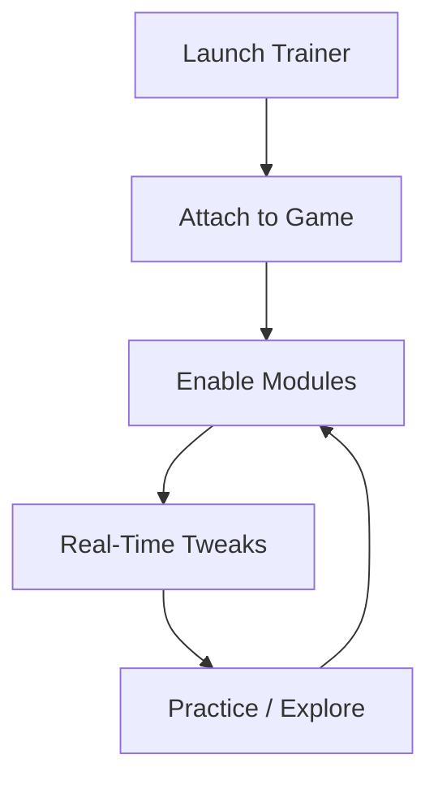

# Black Myth: Wukong Trainer 

In the hush between staff strikes, when stone breathes and legends watch, control becomes poetry. **Black Myth: Wukong Trainer** is a single-player enhancement tool crafted to let you *shape* the journey—softening its thorns or sharpening its edge—without breaking the spell.

Built for **Black Myth: Wukong**, this trainer respects the game’s rhythm. It doesn’t replace mastery; it *guides* it—offering balance knobs for stamina, cooldowns, and pacing so every duel feels deliberate, readable, and fair to your chosen tempo.

---

## 🌙 Overview

This trainer lives quietly beside the game, an external Windows utility with modular toggles. Turn on what you need, leave the rest sleeping. Whether you’re practicing boss patterns, easing difficulty spikes, or capturing cinematic runs, the tool bends—never snaps—to your intent.

---

## 🧩 Feature Set

### ⚔️ Combat Balance

* **Stamina Control**: infinite, reduced drain, or regeneration boost
* **Health Adjustments**: god mode, custom multipliers, or quick refill
* **Damage Tuning**: scale outgoing/incoming damage for fair practice

### ⏳ Skill & Cooldowns

* Instant cooldown reset
* Adjustable cooldown timers (learn timing, then restore default)
* Resource-free skill casting for pattern study

### 🧭 Exploration & Flow

* Movement speed slider (subtle to cinematic)
* Jump height tuning for traversal experiments
* Optional fall-damage disable for exploration runs

### 🧪 Practice & Testing

* Freeze enemies (study animations)
* One-hit mode (quick retries)
* Toggleable hitbox clarity (minimal overlay)

[!NOTE]
Everything is optional. The trainer is meant for **single-player learning, accessibility, and experimentation**.

---

## ⚡ Setup (Windows)

1. Download the latest trainer build
2. Extract to a trusted folder
3. Launch the trainer **before** the game
4. Start Black Myth: Wukong
5. Use the hotkey to open the overlay menu

Example hotkeys:

```ini
[Hotkeys]
MenuToggle = INSERT
GodMode   = F1
Stamina   = F2
Cooldowns = F3
Speed     = F4
```

[!IMPORTANT]
Run as administrator to ensure stable memory access and smooth toggling.

---

Accessibility highlights:

* Large, readable menu fonts
* Slider granularity for fine control
* Profiles for different bosses or regions

---

## 🧠 How It Works



The loop is gentle and continuous—adjust, test, restore—like breathing with the fight.

---

## ❓ FAQ

**Is this safe for online play?**
The game is single-player focused. Use the trainer offline and for personal sessions only.

**Can I restore default difficulty?**
Yes. Every toggle can be disabled instantly, returning the game to its original balance.

**Does it break immersion?**
Used lightly, it *enhances* immersion—letting you learn bosses without frustration loops.

**Are updates frequent?**
Yes. Builds track game patches to maintain stability.

---

## 🌄 Final Thoughts

Wukong’s road is carved from patience. Some days you seek challenge; others, understanding. **Black Myth: Wukong Trainer** gives you the brush—not the painting—so you can choose how bold each stroke should be.

Practice the dance. Study the storm. Then, when you’re ready, turn the aids off and let legend answer legend.

---
